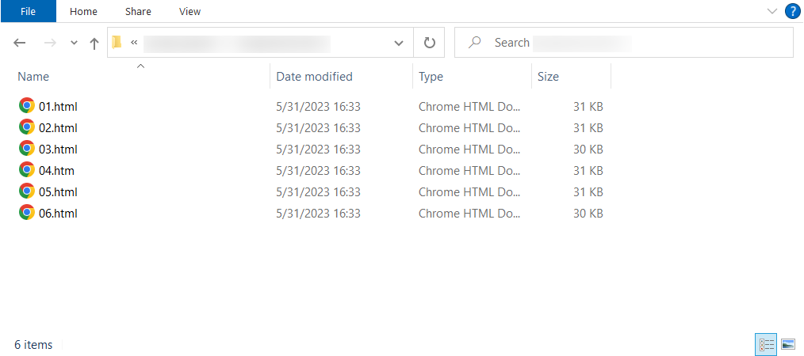
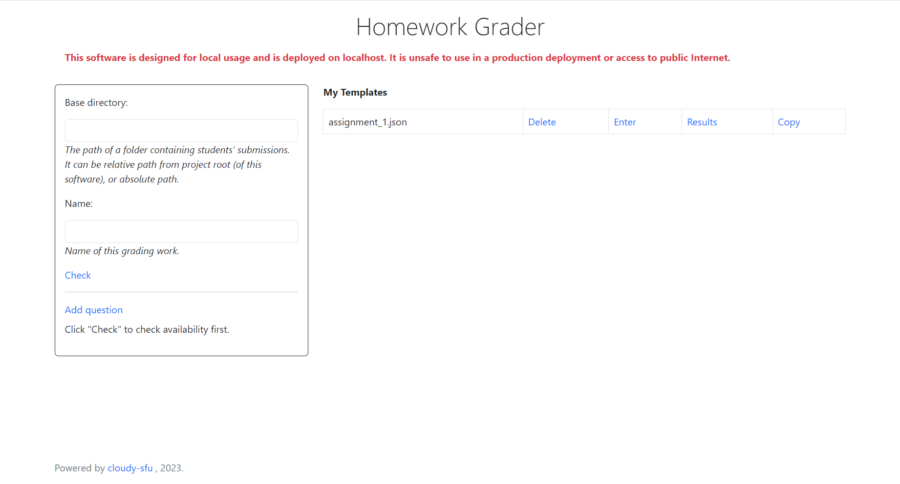
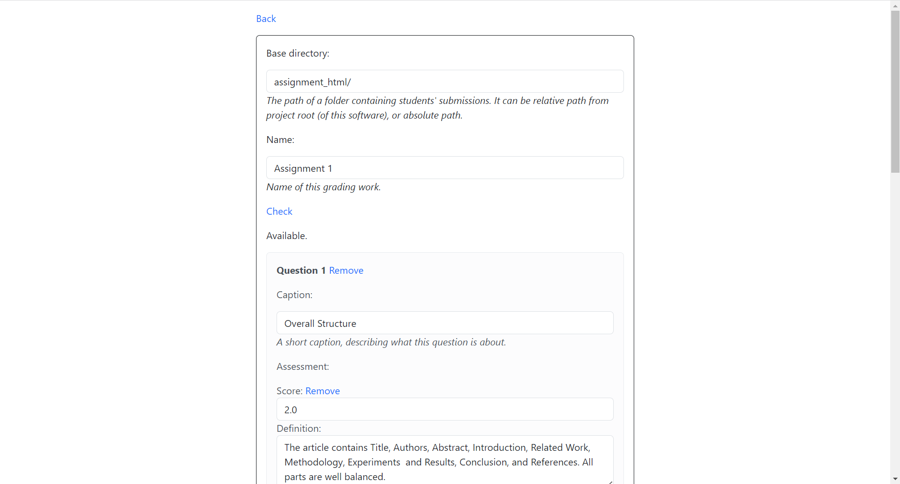
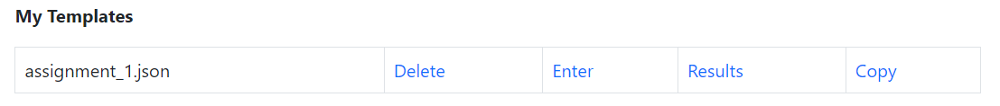
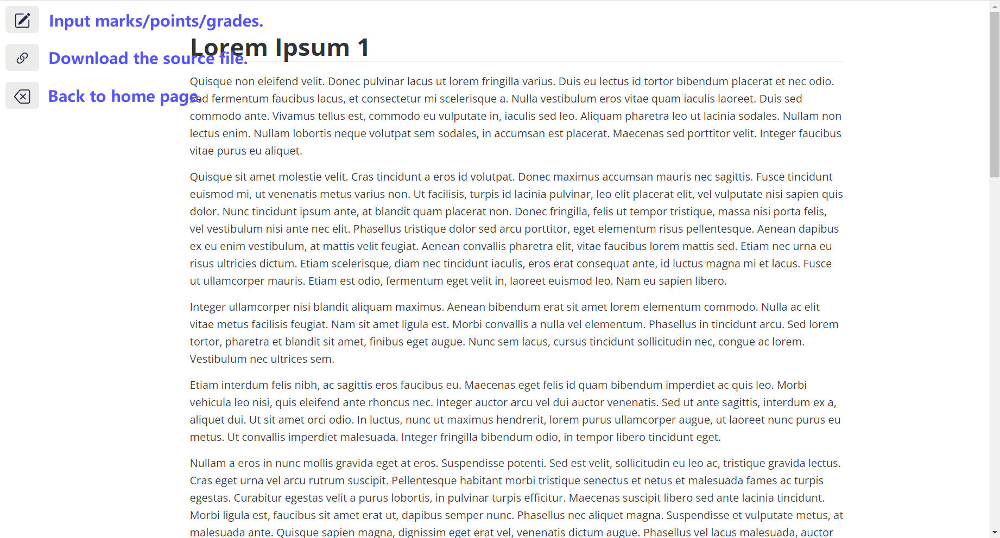
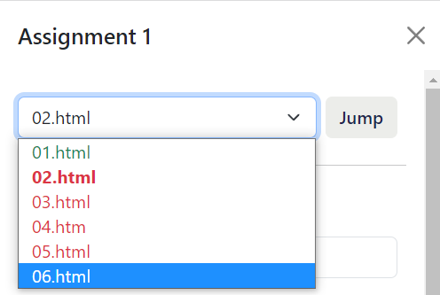
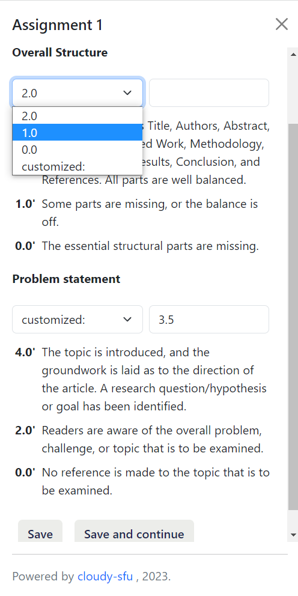
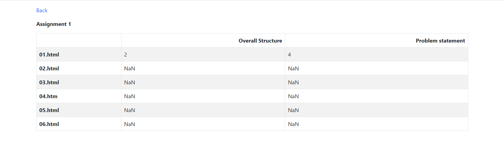

1. Save students' submissions (HTML or PDF) in a folder.

2. Create and manage rubric templates. Input the folder above in "base directory" field.
   *The security policy of most web browsers says web applications cannot access users' local file structure, therefore we cannot start a file explorer to pick this folder. You have to input file path manually.*

3. Click "Check" button to confirm the name of configuration isn't occupied.

4. Click "Add question" to add a question or dimension of assessment, then input the caption. Click "Add level" to edit the rubric: add scores and corresponding definitions. Submit the configuration when finished.

5. The configuration is listed at "My template" now.

6. Click "Enter" to start grading.

7. Click the first button at the left, see the progress. The current previewed file is bold, graded files are green and ungraded files are red. To jump to another file, select and click "Jump".

8. Drop down and select a score in rubric, or input a customized score. Click "Save" when finished, or click "Save and continue" to save and jump to the next file. Click the third button in step 6 when finished to grade all files.

9. Click "Results" in step 5 to show the grades of the whole class. Ungraded files are shown as "NaN".

10. To create a similar rubric next time, click "Copy" in step 5 to create a new configuration based on an existed template.